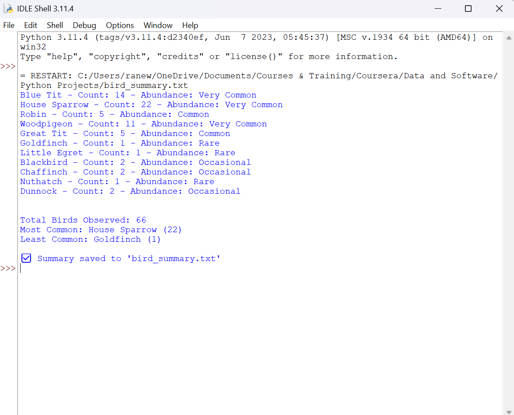

#  Garden Birdwatch Summary
This project is a Python-based script that summarises and categorises garden bird sightings from a UK birdwatching session.
It analyses the number of birds observed, classifies species based on abundance levels, identifies the most and least common birds, and saves the results to a summary text file.

---

##  Project Purpose

The goal of this project is to demonstrate practical Python skills in an ecological context.  
It is designed for early-career conservationists, ecologists, or data enthusiasts who want to automate simple survey summaries and enhance their coding portfolios.

---

##  Features

- Calculate total birds observed
- Categorise species by abundance levels:
  - Very Common (≥10)
  - Common (≥5)
  - Occasional (≥2)
  - Rare (≤1)
- Identify the most and least observed species
- Save output to a clean `bird_summary.txt` file
- Provide real-world conservation-themed coding experience

---

##  Skills Used

- **Python 3**: Functions, loops, conditionals, dictionaries, list operations
- **File Handling**: Writing output to a `.txt` file
- **Data Categorisation**: Defining abundance classes based on count
- **Basic Git and GitHub**: Version control and publishing a portfolio project

---

##  How to Run the Script

1. Clone or download this repository
2. Ensure Python 3.x is installed on your machine
3. Open a terminal/command prompt in the project folder
4. Run the script:
```bash
python garden_birdwatch.py
```
## 📷 Example Output

 


